<!--
  Generated by scripts/build.mjs from profile.config.mjs and live GitHub data.
  Edit those files, not this one. Rebuilt daily by .github/workflows/profile.yml.
-->

<a href="https://nazrulmornie.my"></a>

<a href="https://github.com/mohammad-nazrul?tab=repositories"></a>

<a href="https://github.com/mohammad-nazrul"></a>

<a href="https://github.com/mohammad-nazrul?tab=repositories"></a>

  <a href="https://nazrulmornie.my"></a>
  <a href="https://nazrulmornie.my"></a>

  <a href="https://github.com/mohammad-nazrul/rent-bro"></a>
  <a href="https://nazrulmornie.my"></a>

  <a href="https://nazrulmornie.my"></a>
  <a href="https://github.com/mohammad-nazrul/enelayan"></a>

  <a href="https://nazrulmornie.my"></a>
  <a href="https://github.com/mohammad-nazrul/koda"></a>

<a href="https://nazrulmornie.my"></a>

<a href="https://nazrulmornie.my"></a>

  
  
  

